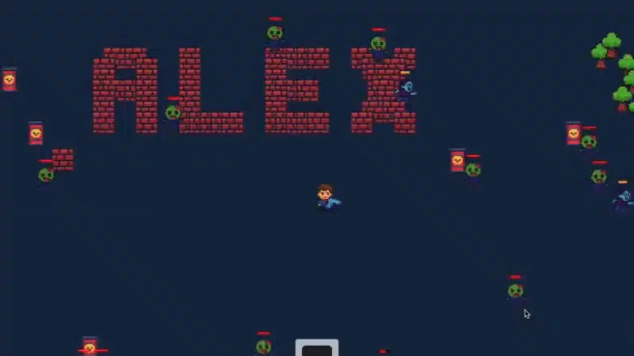

# Top-Down Survival Shooter

A zombie survival shooter game built with Phaser.js. Control a character in a top-down view, fight waves of zombies, collect coins, and upgrade your weapons to survive as long as possible.

## Demo


## Features

- WASD movement and mouse aiming/shooting
- Multiple zombie types with different behaviors
- Destructible environment (walls, trees, explosive barrels)
- Weapon shop system (press C to open)
- Particle effects and visual feedback
- Progressive difficulty scaling

## Getting Started

### Prerequisites

- Node.js 14 or higher
- npm

### Installation

1. Clone the repository
2. Install dependencies:
   ```bash
   npm install
   ```

### Running the Game

For development with live reload:
```bash
npm run dev
```

For production serve:
```bash
npm start
```

The game will be available at `http://localhost:8000/src/`

### Building

To create a production build:
```bash
npm run build
npm run serve:dist
```

## How to Play

- **WASD**: Move your character
- **Mouse**: Aim and click to shoot
- **C**: Open weapon shop
- **Goal**: Survive waves of zombies and collect coins to buy better weapons

## License

MIT